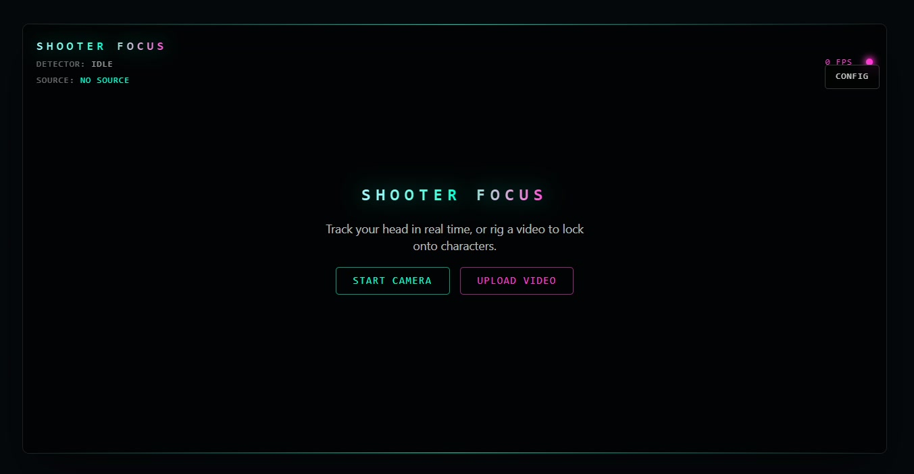

# Shooter Focus

A real-time AI-powered head tracking application that displays a futuristic gaming HUD targeting reticle on your face via webcam.

---

## Screenshots



---

## Features

- **Real-time face detection** via MediaPipe Face Detection (blaze_face_short_range model, loaded from CDN)
- **Live webcam OR video file tracking** — upload any local video (.mp4/.webm/.mov) and the HUD locks onto faces/characters in it
- **Jitter-free head tracking** using a One-Euro filter pipeline with configurable smoothing parameters
- **Target lock overlay** — segmented quadrant arcs, inner dashed ring, crosshair + center dot
- **HUD effects** — pulsing ring, radar scan animation, cardinal reticle brackets, soft glow
- **Loss persistence** — target holds briefly during brief occlusion before releasing
- **Customization panel** — circle size slider, color presets (6), toggle ring / dot / animation / effects
- **Performance optimized** — DPR capped at 2, idle-skip canvases, transform caching, tab-hidden detection skip
- **FPS display** — live smoothed frame-rate counter in the HUD header
- **Strict TypeScript** — zero `any` types, strict compiler options
- **Fully typed config** — ESLint + Prettier + Tailwind CSS

---

## Getting Started

### Prerequisites

- Node.js 18+
- A modern browser with `getUserMedia` support (Chrome, Firefox, Edge, Safari 14+)

### Install

```bash
git clone <repository-url>
cd shooter-focus
npm install
```

### Development

```bash
npm run dev
```

Open the URL shown in the terminal. Grant camera permission when prompted.

### Production build

```bash
npm run build
npm run preview
```

---

## Scripts

| Command                | Description                                          |
| ---------------------- | ---------------------------------------------------- |
| `npm run dev`          | Start the Vite dev server with HMR                   |
| `npm run build`        | Type-check (`tsc -b`) and produce a production build |
| `npm run lint`         | Lint all source files with ESLint                    |
| `npm run format`       | Auto-format source files with Prettier               |
| `npm run format:check` | Verify formatting (CI-ready)                         |
| `npm run preview`      | Serve the production build locally                   |

---

## Architecture

```
shooter-focus/
├── src/
│   ├── components/
│   │   ├── DebugOverlay/        — raw detection bounding box + keypoints
│   │   ├── SettingsPanel/       — collapsible HUD config sidebar
│   │   ├── TargetLockOverlay/   — smoothed lock-on ring + effects
│   │   └── WebcamFeed/          — camera stream + permission UI
│   ├── hooks/
│   │   ├── useHeadTracking.ts   — detection loop + TrackingEngine
│   │   ├── useHudSettings.ts    — HUD settings state management
│   │   └── useWebcam.ts         — getUserMedia lifecycle
│   ├── services/
│   │   ├── FaceDetectorService.ts — MediaPipe Face Detector wrapper
│   │   └── TrackingEngine.ts      — One-Euro smoothing + loss handling
│   ├── types/
│   │   ├── face.ts
│   │   ├── hud.ts
│   │   ├── hudSettings.ts
│   │   ├── tracking.ts
│   │   └── webcam.ts
│   ├── utils/
│   │   ├── fps.ts               — EMA-based FPS tracker
│   │   ├── oneEuro.ts           — One-Euro filter implementation
│   │   └── videoTransform.ts    — object-cover coordinate mapping
│   ├── App.tsx
│   ├── index.css
│   └── main.tsx
├── eslint.config.js
├── .prettierrc
├── tailwind.config.ts (via @tailwindcss/vite)
├── tsconfig.app.json
└── vite.config.ts
```

### Data flow

```
getUserMedia ──► <video> ──► useHeadTracking rAF loop
                                 │
                 ┌───────────────┤
                 ▼               ▼
        FaceDetectorService   TrackingEngine
         (mediapipe)        (One-Euro filter)
                                 │
                 ┌───────────────┤
                 ▼               ▼
          faceRef (raw)    targetRef (smoothed)
                 │               │
         DebugOverlay     TargetLockOverlay
         (canvas)          (canvas + effects)
                                 ▲
                          SettingsPanel
                          (style + effects)
```

### Key decisions

| Decision                     | Rationale                                                                                               |
| ---------------------------- | ------------------------------------------------------------------------------------------------------- |
| MediaPipe tasks-vision (CDN) | Zero-install, WebAssembly, GPU/CPU fallback, officially maintained                                      |
| One-Euro filter              | Industry-standard for low-latency, frequency-adaptive smoothing; no motion prediction needed            |
| Mutable refs + canvas rAF    | Avoids React re-renders at tracking frame-rate; overlays draw at display refresh independently of React |
| DPR capped at 2              | Halves canvas memory vs. retina without visible quality loss                                            |
| Loss persistence (400 ms)    | Target remains during brief blink or fast motion, preventing flickering                                 |

---

## Tech Stack

| Layer      | Technology                                                       |
| ---------- | ---------------------------------------------------------------- |
| Framework  | React 19 + TypeScript 6                                          |
| Build      | Vite 8                                                           |
| CV         | MediaPipe tasks-vision 1.0.1 (`FaceDetector`, `FilesetResolver`) |
| Styling    | Tailwind CSS 4                                                   |
| Linting    | ESLint + typescript-eslint                                       |
| Formatting | Prettier                                                         |

---

## Configuration

### Tracking parameters

Defaults in `src/types/tracking.ts`:

| Parameter       | Default | Description                                                     |
| --------------- | ------- | --------------------------------------------------------------- |
| `minCutoff`     | 1.2     | One-Euro low-pass frequency cutoff (Hz) for position            |
| `beta`          | 0.4     | One-Euro speed coefficient (higher = less lag on fast movement) |
| `sizeMinCutoff` | 0.6     | Low-pass cutoff for circle radius                               |
| `lossTimeoutMs` | 400     | Duration (ms) to hold target after face is lost                 |

### HUD colors

Defined in `src/types/hudSettings.ts`:

```ts
HUD_COLOR_PRESETS = [
  '#00ffd5', // Cyan
  '#ff3bd5', // Magenta
  '#7bff3b', // Lime
  '#ffb03b', // Amber
  '#5fd4ff', // Ice
  '#ff4b4b', // Red
]
```

---

## Contributing

1. Fork the repository
2. Create a feature branch (`git checkout -b feat/my-feature`)
3. Make your changes and ensure all checks pass:

```bash
npm run build && npm run lint && npm run format:check
```

4. Commit with a conventional prefix: `feat:`, `fix:`, `refactor:`, `docs:`, `style:`, `perf:`
5. Push and open a Pull Request

---

## License

MIT
